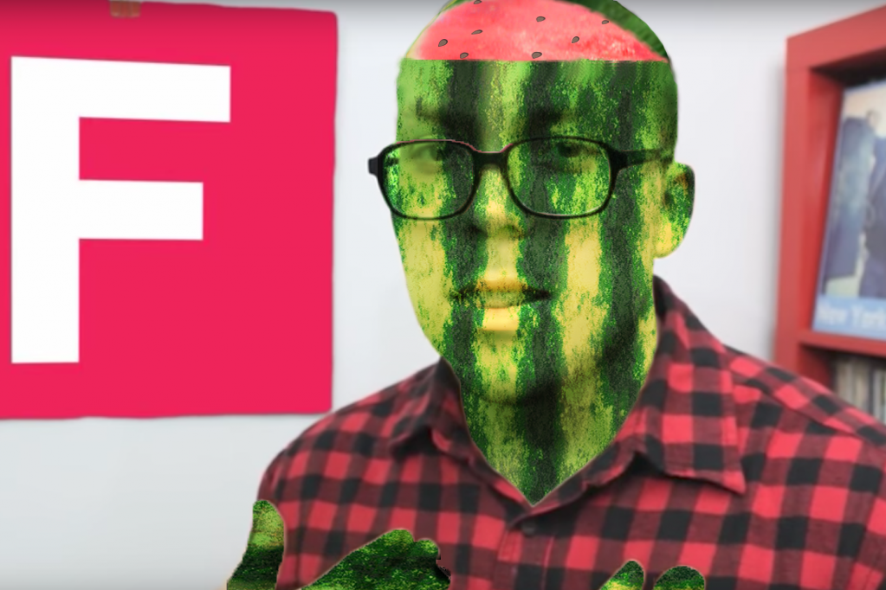
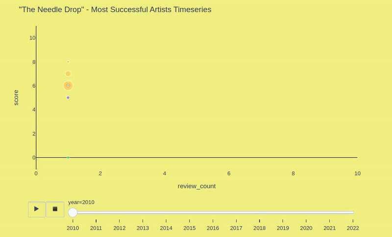
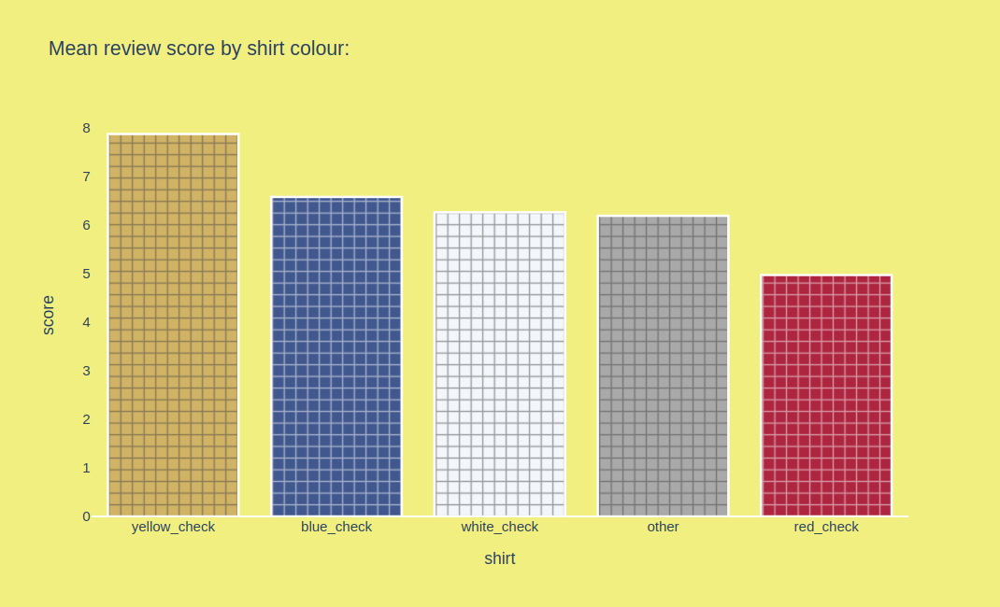
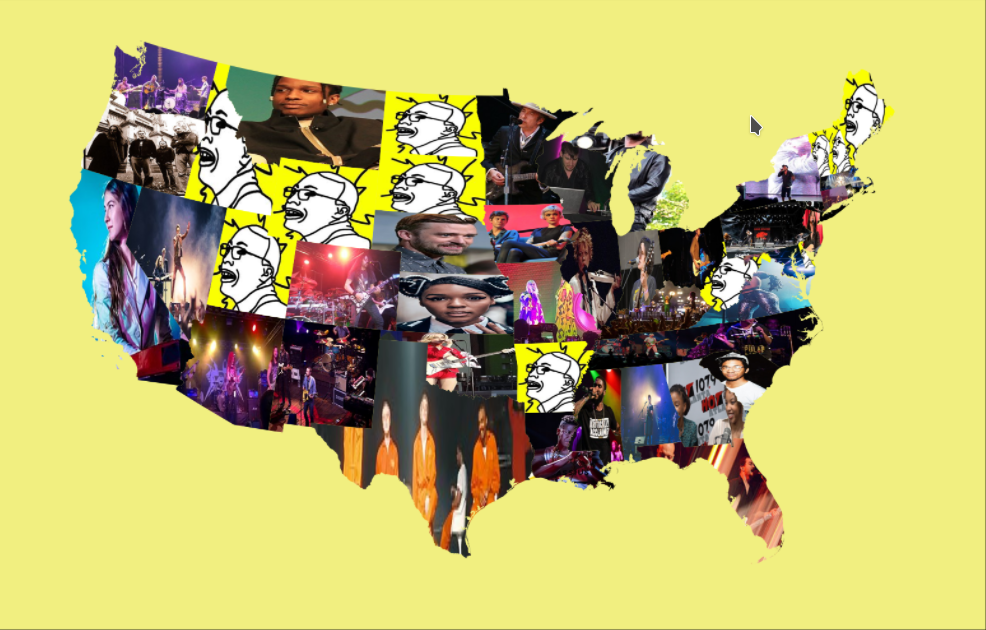
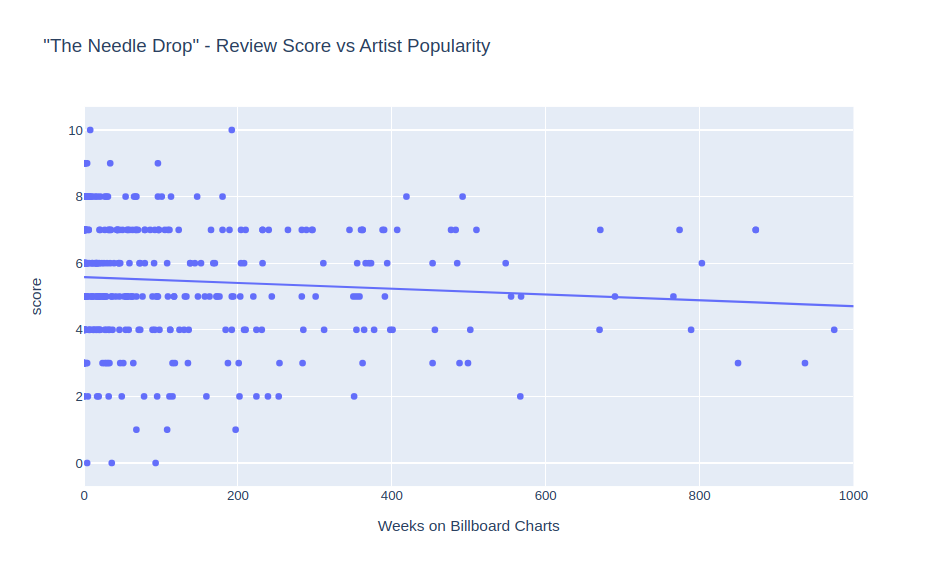

# Dissecting "The Needle Drop"

A Python Notebook mining, analysing and visualising the reviews of YouTube music critic The Needle Drop (Anthony Fantano).
This project considers everything from genre bias to clothing choice in determining which variables positively
correlate with a review’s score.

## Featured Visualisations:

This Sunburst chart shows all the genres The Needle Drop has reviewed, where darker segments indicate higher average reviews for that genre. Unsurpisingly we see Fantano's inner metal-head shining through, with some of his top reviewed subgenres being metal, noise rock, industrial hip hop, noise pop (all 7.5+).

Industrial hip hop might have made it into TND's top subgenres thanks to Death Grips. In the following bubble plot they are clearly the most consistent artist, achieving an average of 8.3 across 9 releases. Kanye West (13M) and Kendrick Lamar (11M) are on top in terms of total views.

A recurring meme in the Fantano community is the famed Yellow Check shirt; commonly associated with rare 10/10 reviews on the channel. To check if clothing did have any correlation with score, Fantano's shirts across 2000+ thumbnails were isolated using computer vision and converted into a colour histogram to detect style automatically. The following results are clear. The yellow shirt does in fact predict high scores, while the red appears in lower rating reviews. The remaining colours have little influence on score.

The top reviewed US artists by state.

Here I tried to see if Fantano is objectively a music hipster. Do his reviews negatively correlate with an artist's popularity to date, as measured by number of weeks of the US Billboard Charts? Yes. But with only a weak 0.13 correlation. 

## Check Out These Repos / Inspirations!
https://www.youtube.com/c/theneedledrop

https://github.com/anish9/Fashion-AI-segmentation

https://deepaksatheesan.com/filling-shapefile-polygons-with-images-gis-visualization-using-python/
